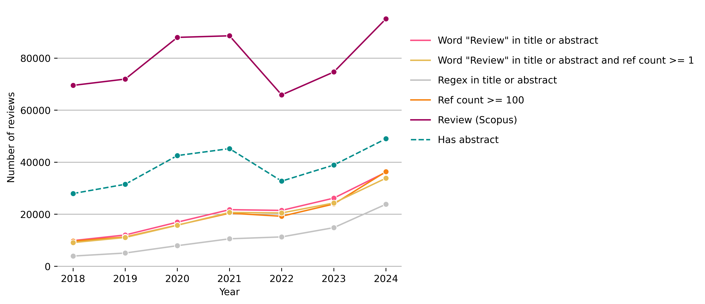

# Identifying Reviews in OpenAlex

This repository contains a short analysis of reviews in OpenAlex. 

## Data

The following data sources were used:

- OpenAlex (2025/02): fiz_openalex_bdb_20250201
- Scopus (2025/01): scp_b_202501

Data from the [Kompetenznetzwerk Bibliometrie](https://zenodo.org/records/13935407) was used. 

Data is limited to journal publications from 2018 to 2024. This analysis only considers items with the document type "article" 
from OpenAlex and items with the document type "Review" from Scopus.

## Method 
Four strategies were tested for identifiying reviews:

- 1: The word "Review" appears in the title or abstract of a publication
- 2: The word "Review" appears in the title or abstract of a publication and the reference count is at least 1 or higher.
- 3: A specific regular expression appears in the title or abstract of a publication.
- 4: A publication has a reference count of 100 or more.

## Result

Overall, only about a quarter of the reviews from Scopus can be identified using the selected strategies. Most reviews are recognised using strategy 1 (The word "Review" appears in the title or abstract of a publication). A total of 144.546 items (26%) can be identified using this method. However, this strategy, as well as strategies 2 and 4, could potentially misclassify many research articles and other items in OpenAlex, as shown in Table 1. Here, the strategy 3 (A specific regular expression appears in the title or abstract of a publication.) is more precise (see also the sample analyses and Table 2). Note that about 52% (285,753) of the reviews included in this analysis do not contain an abstract, which makes it difficult to identify reviews.

<figure>
    
    <figcaption>
        <b>Fig.1: </b>Comparison of different strategies for identifying reviews. Only items with the document type 'article' in OpenAlex and the type 'Review' in Scopus are considered. 
    </figcaption>
</figure>

<b>Tab.1: </b>Items included in OpenAlex that would be classified as reviews according to strategy 2 and the corresponding document types in Scopus. 

| n	     | oal_type	 |  scp_type           |
|--------|-----------|---------------------|
| 302348 | article	 | -> Article          |
| 3	     | article	 | -> Article in Press |
| 2	     | article	 | -> Book             |
| 112	 | article   | -> Chapter          |
| 14167	 | article	 | -> Conference Paper |
| 352	 | article   | -> Data Paper       |
| 4850	 | article 	 | -> Editorial        |
| 319	 | article   | -> Erratum          |
| 4947	 | article	 | -> Letter           |
| 7888	 | article	 | -> Note             |
| 135206 | article	 | -> Review           |
| 2489	 | article	 | -> Short Survey     |
| 238	 | article	 | -> Tombstone        |

<b>Tab.2: </b>Items included in OpenAlex that would be classified as reviews according to strategy 3 and the corresponding document types in Scopus. 

| n	     | oal_type	 |  scp_type           |
|--------|-----------|---------------------|
| 77659  | article	 | -> Article          |
| 33	 | article	 | -> Chapter          |
| 3937   | article	 | -> Conference Paper |
| 87	 | article   | -> Data Paper       |
| 1157	 | article	 | -> Editorial        |
| 247	 | article   | -> Erratum          |
| 1129	 | article 	 | -> Letter           |  
| 2100	 | article   | -> Note             |
| 77339	 | article	 | -> Review           |
| 1246	 | article	 | -> Short Survey     |
| 56     | article	 | -> Tombstone        |

## Appendix

Regular expression: 

abstract ~ '(\sthis\s|systematic\s|umbrella\s|bibliographic\s|literature\s|scoping\s|comprehensive\s|mini-)review'
title ~ '(\sa\s|systematic\s|umbrella\s|bibliographic\s|literature\s|scoping\s|comprehensive\s|mini-)review'

